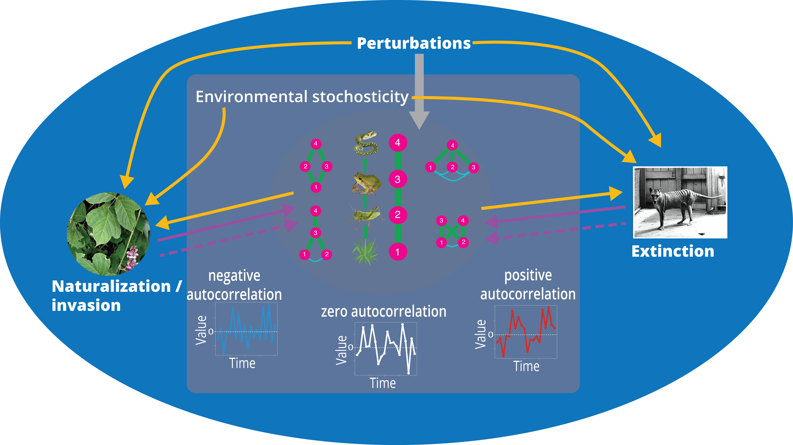

---
---

<link rel="stylesheet" href="styles.css" type="text/css">

**I am a postdoctoral researcher in the [Ecology Lab](https://www.biologie.uni-konstanz.de/kleunen/) of University of Konstanz. My interest is in using database analysis and computer simulations to answer questions in community ecology and macroecology. Currently I mainly combine the [Global Naturalized Alien Flora database](https://glonaf.org/) with other excellent databases to explore these topics.**

**I obtained a BS in Marine Biological Resources and a MS in Freshwater Biology from China. Afterwards, I started my study and research abroad. I began working as a lab assistant and then a PhD candidate in [Trinity College Dublin](https://www.tcd.ie/), Ireland. Working with [Dr. Ian Donohue](https://www.tcd.ie/Zoology/research/groups/donohue/) and [Dr. Andrew L Jackson](http://www.tcd.ie/Zoology/research/groups/jackson/), I investigated the multidimensionality of ecological stability. In June 2018, I joined the [Ecology Lab](https://www.biologie.uni-konstanz.de/kleunen/) as a postdoc research associate working with [Prof. Mark van Kleunen](https://www.biologie.uni-konstanz.de/kleunen/ecology-team/prof-dr-mark-van-kleunen/) on the macroecology of global naturalized plant species.**

